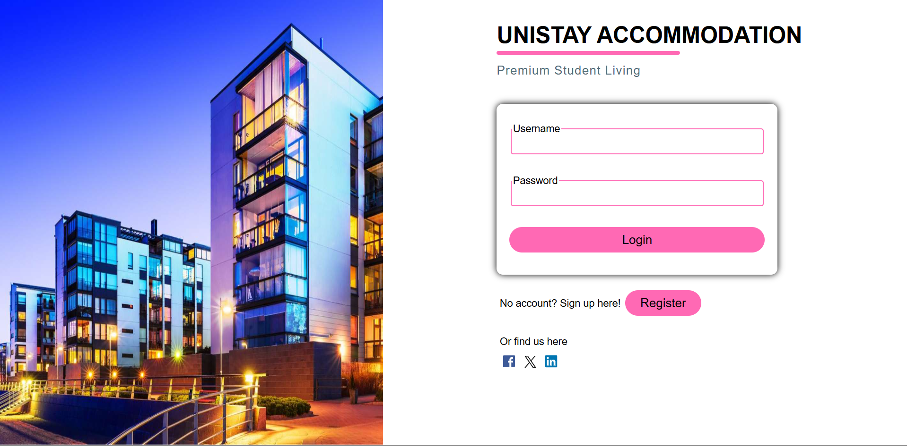
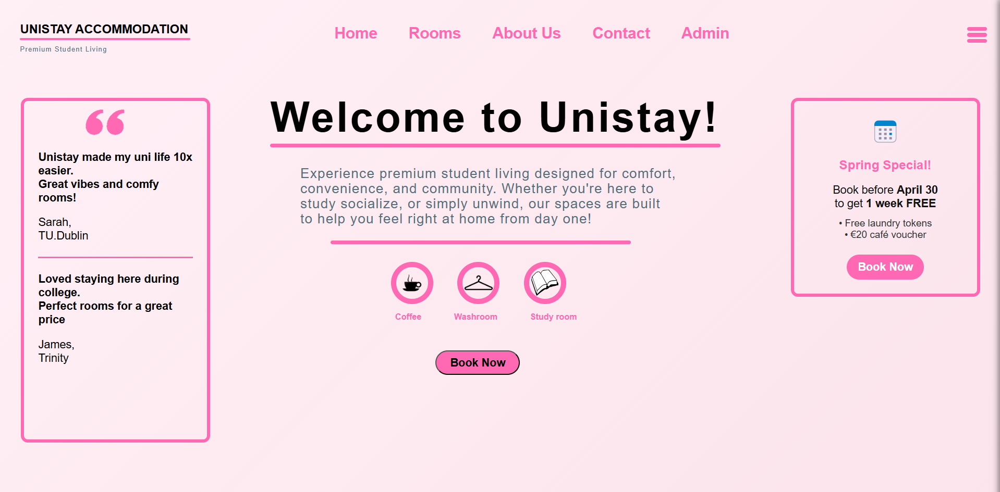
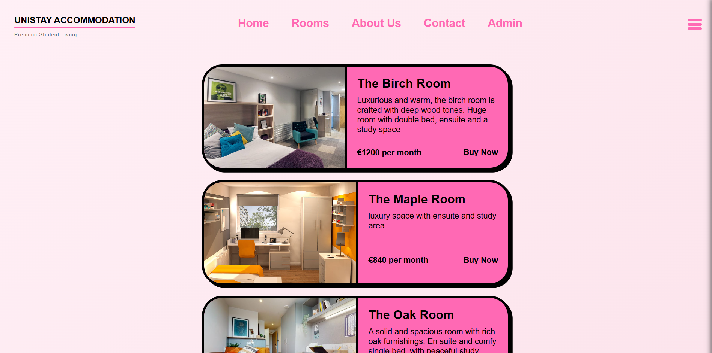
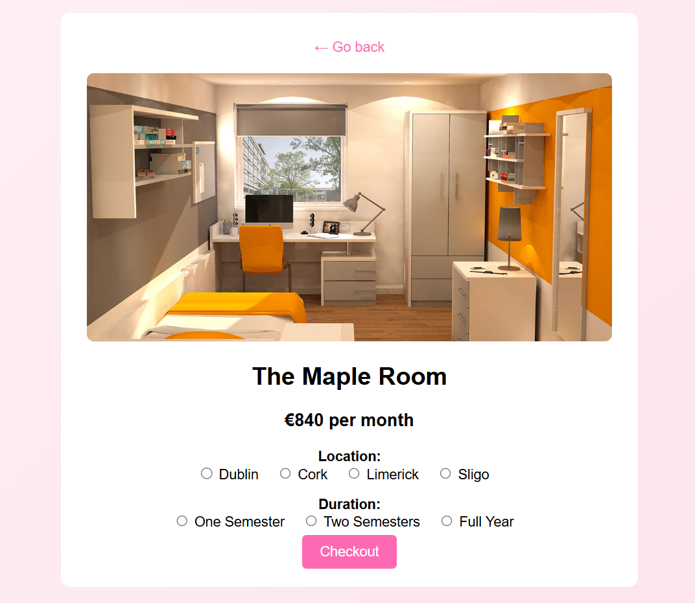
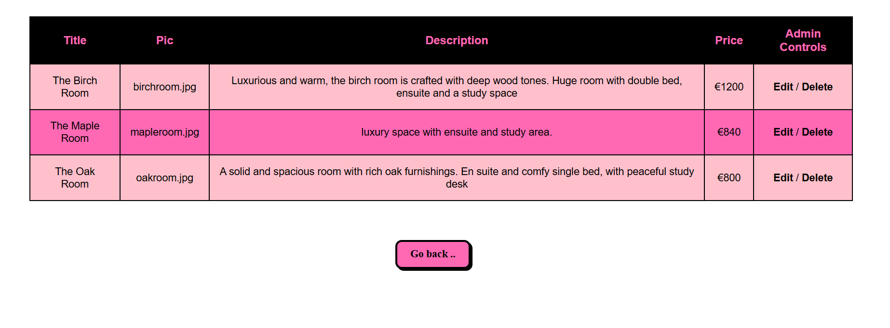
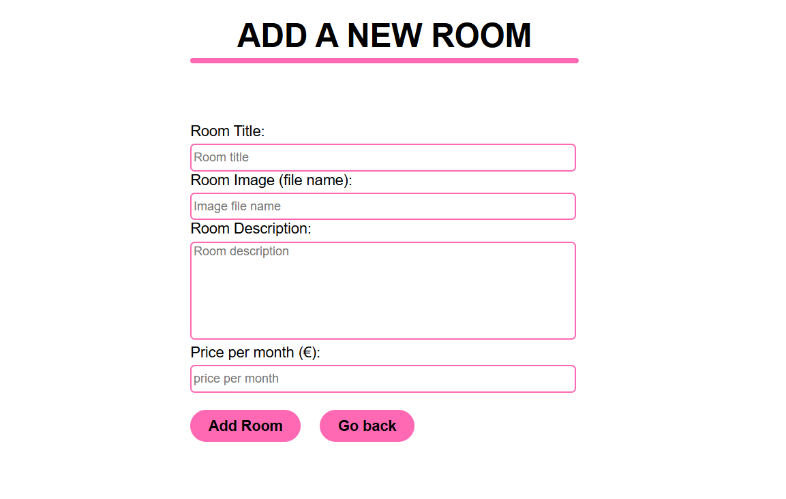

# UNISTAY ACCOMMODATION
**UNISTAY ACCOMMODATION** is a student-focused accommodation showcase website built using **HTML**, **CSS**, and **PHP**. It simulates the experience of browsing, selecting, and "purchasing" student rooms online. While all functionality is for demonstration purposes only, the site provides a realistic and professional-looking interface suitable for portfolio or academic presentation.

## 🌐 Features
### 🔐 Authentication System

&nbsp;&nbsp;&nbsp;&nbsp;&nbsp;&nbsp;&nbsp;&nbsp;Login & Register pages

&nbsp;&nbsp;&nbsp;&nbsp;&nbsp;&nbsp;&nbsp;&nbsp;User sessions with PHP-based login verification

&nbsp;&nbsp;&nbsp;&nbsp;&nbsp;&nbsp;&nbsp;&nbsp;Admin account unlocks extra features

### 🏠 Website Pages

&nbsp;&nbsp;&nbsp;&nbsp;&nbsp;&nbsp;&nbsp;&nbsp;Home Page - Naviagte to anywhere, check out facilities and other stuff

&nbsp;&nbsp;&nbsp;&nbsp;&nbsp;&nbsp;&nbsp;&nbsp;Rooms Page - Browse available student rooms

&nbsp;&nbsp;&nbsp;&nbsp;&nbsp;&nbsp;&nbsp;&nbsp;About Page - Read about UNISTAY

&nbsp;&nbsp;&nbsp;&nbsp;&nbsp;&nbsp;&nbsp;&nbsp;Contact Page - Contact info for UNISTAY

&nbsp;&nbsp;&nbsp;&nbsp;&nbsp;&nbsp;&nbsp;&nbsp;My Account – Update user details

&nbsp;&nbsp;&nbsp;&nbsp;&nbsp;&nbsp;&nbsp;&nbsp;Admin Page – Add, edit, or delete rooms and users (admin only)

### 🛒 Checkout System (showcase)

&nbsp;&nbsp;&nbsp;&nbsp;&nbsp;&nbsp;&nbsp;&nbsp;"Buy" option on each room listing

&nbsp;&nbsp;&nbsp;&nbsp;&nbsp;&nbsp;&nbsp;&nbsp;Area and duration selection

&nbsp;&nbsp;&nbsp;&nbsp;&nbsp;&nbsp;&nbsp;&nbsp;Payment page with card detail form (non-functional, for display only)

### 📋 Navigation

&nbsp;&nbsp;&nbsp;&nbsp;&nbsp;&nbsp;&nbsp;&nbsp;Nav links - Quick access to all major pages

&nbsp;&nbsp;&nbsp;&nbsp;&nbsp;&nbsp;&nbsp;&nbsp;Sidebae - My Account section for profile updates

### 🗃️ Databases
&nbsp;&nbsp;&nbsp;&nbsp;Users Database

&nbsp;&nbsp;&nbsp;&nbsp;&nbsp;&nbsp;&nbsp;&nbsp;Stores account information for login, registration, and profile management

&nbsp;&nbsp;&nbsp;&nbsp;&nbsp;&nbsp;&nbsp;&nbsp;Admin accounts flagged for additional privileges

&nbsp;&nbsp;&nbsp;&nbsp;Rooms Database

&nbsp;&nbsp;&nbsp;&nbsp;&nbsp;&nbsp;&nbsp;&nbsp;Stores information about available rooms (price, image, details)

&nbsp;&nbsp;&nbsp;&nbsp;&nbsp;&nbsp;&nbsp;&nbsp;Admins can add, modify, or delete room listings

### 🛠️ Tech Stack
&nbsp;&nbsp;&nbsp;&nbsp;&nbsp;&nbsp;&nbsp;&nbsp;Frontend: HTML5, CSS3

&nbsp;&nbsp;&nbsp;&nbsp;&nbsp;&nbsp;&nbsp;&nbsp;Backend: PHP (vanilla, procedural style)

&nbsp;&nbsp;&nbsp;&nbsp;&nbsp;&nbsp;&nbsp;&nbsp;Database: MySQL

### ⚠️ Disclaimer
&nbsp;&nbsp;&nbsp;&nbsp;&nbsp;&nbsp;&nbsp;&nbsp;This project is entirely fake and for showcase purposes only. No real purchases, transactions, or user data storage are performed outside of 
&nbsp;&nbsp;&nbsp;&nbsp;&nbsp;&nbsp;&nbsp;&nbsp;a local/dev environment.

### 📸 Screenshots

### 🚀 How to Run Locally Using XAMPP
&nbsp;&nbsp;&nbsp;&nbsp;&nbsp;&nbsp;&nbsp;&nbsp;Clone the repository or download the ZIP

&nbsp;&nbsp;&nbsp;&nbsp;&nbsp;&nbsp;&nbsp;&nbsp;Place it in your local server directory (e.g. htdocs for XAMPP)

&nbsp;&nbsp;&nbsp;&nbsp;&nbsp;&nbsp;&nbsp;&nbsp;Import the provided SQL files (users.sql, rooms.sql) into your local MySQL database

&nbsp;&nbsp;&nbsp;&nbsp;&nbsp;&nbsp;&nbsp;&nbsp;Start your Apache and MySQL services

&nbsp;&nbsp;&nbsp;&nbsp;&nbsp;&nbsp;&nbsp;&nbsp;Navigate to "http: //localhost/(local server directory)/StudentAccomWebsite/index.php" in your browser
